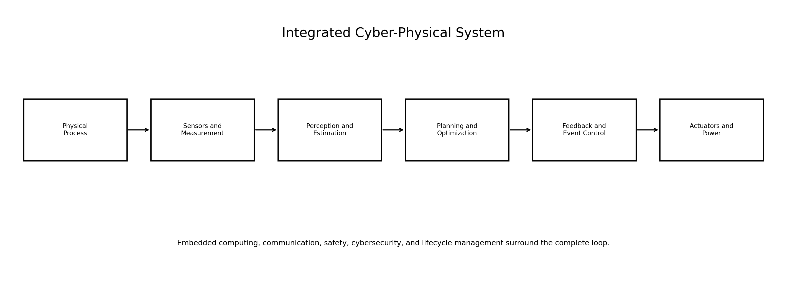
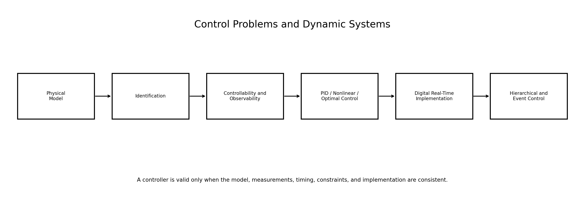
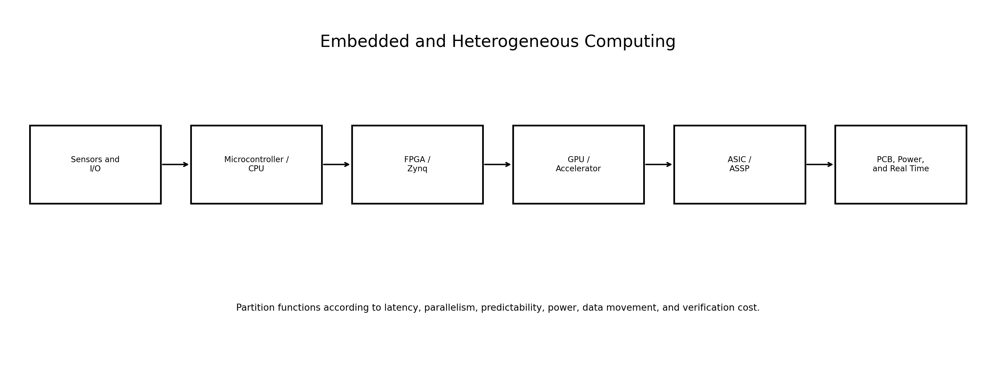
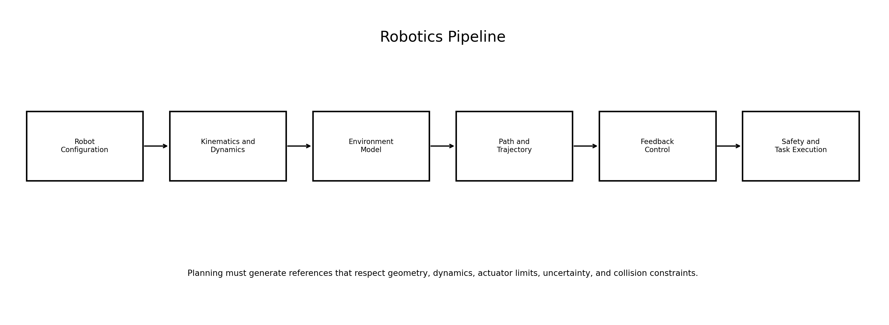
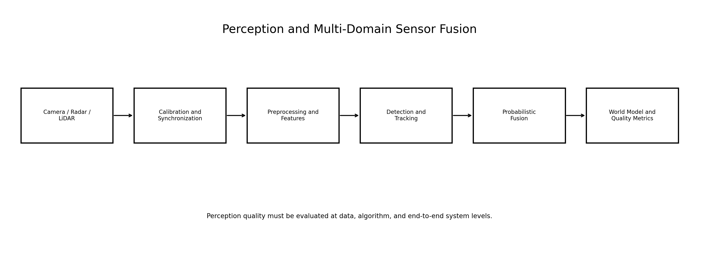
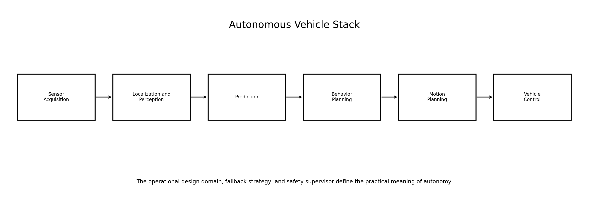
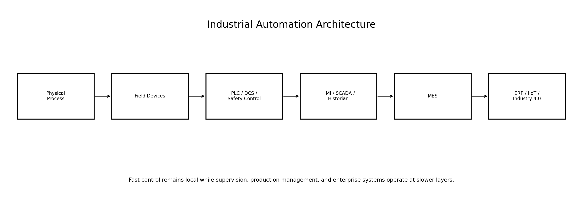
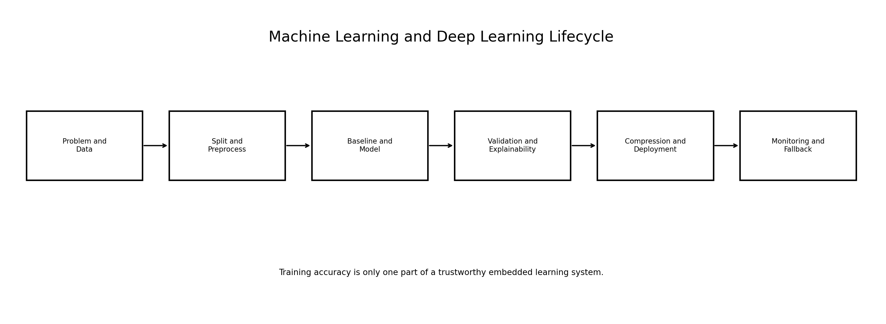
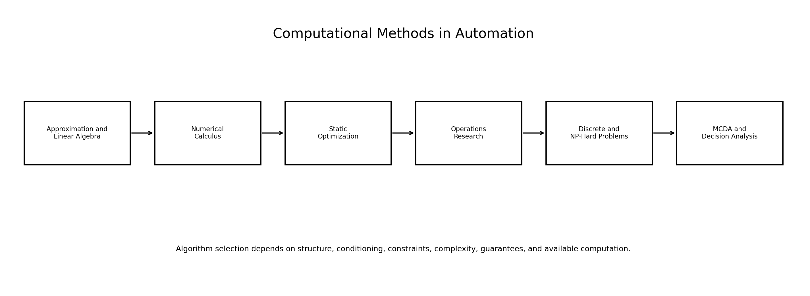
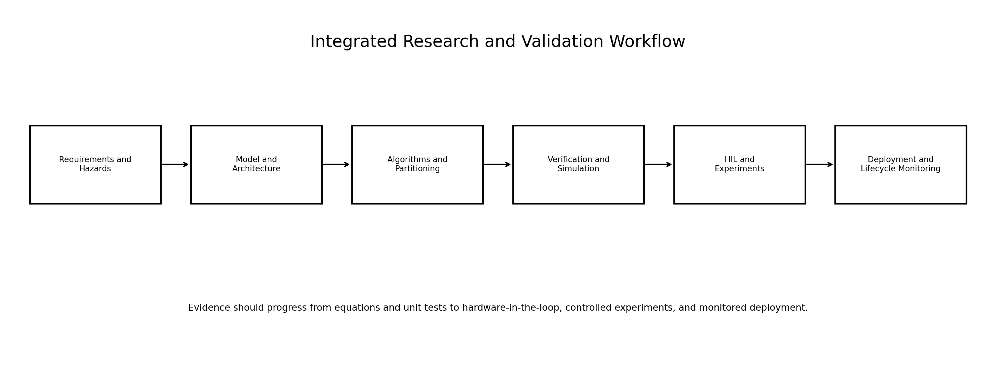

<div align="center">

# Integrated Automation, Robotics, Embedded AI, and Computational Methods

## One Comprehensive Research-Level Lecture

### Control · Embedded Systems · Robotics · Perception · Autonomous Vehicles · Industrial Automation · Machine Learning · Deep Learning · Optimization

</div>

---

## Repository Purpose

This repository contains **one integrated lecture** that connects the major technical areas required to design modern intelligent automation systems:

- Control problems and dynamic systems.
- Embedded systems and heterogeneous computing.
- Industrial and autonomous robotics.
- Computer vision, radar, LiDAR, and sensor fusion.
- Autonomous vehicles and driver-assistance systems.
- Automation of industrial processes, DCS, IIoT, and Industry 4.0.
- Machine learning and reinforcement learning.
- Deep learning, explainable AI, and model compression.
- Numerical methods, optimization, operations research, complexity, dynamic programming, and multi-criteria decision analysis.

The lecture is written as a systems-level research narrative rather than as nine disconnected summaries. It explains how models, estimation, control, computation, perception, learning, communication, safety, and optimization interact inside one cyber-physical system.

---

## Main Lecture

[Open the complete lecture](lecture/ONE_COMPREHENSIVE_LECTURE.md)

---

## Generated System Maps

<p align="center"></p>
<p align="center"></p>
<p align="center"></p>
<p align="center"></p>
<p align="center"></p>
<p align="center"></p>
<p align="center"></p>
<p align="center"></p>
<p align="center"></p>
<p align="center"></p>

---

## Executable Laboratory

The repository includes compact educational implementations of:

- Linear and nonlinear dynamic simulation.
- Controllability, observability, PID, LQR, and least-squares identification.
- Fixed-priority real-time schedulability.
- FPGA/GPU/CPU partitioning metrics.
- Robot forward kinematics and trajectory generation.
- Grid planning and occupancy mapping.
- Image preprocessing, optical flow, stereo depth, and Kalman sensor fusion.
- Autonomous-vehicle stopping-distance, time-to-collision, and path planning.
- Event-driven industrial control and IIoT payload construction.
- Linear regression, PCA, Gaussian Naive Bayes, linear SVM, decision stump, and Q-learning.
- Neural-network parameter counting, quantization, pruning, and compression analysis.
- Numerical differentiation, integration, root finding, optimization, dynamic programming, and weighted multi-criteria analysis.

Run everything:

```bash
python3 experiments/run_integrated_lab.py
pytest -q
```

---

## Repository Structure

```text
integrated-automation-robotics-embedded-ai-systems-lecture/
├── README.md
├── lecture/
│   └── ONE_COMPREHENSIVE_LECTURE.md
├── src/
│   ├── control_systems.py
│   ├── embedded_systems.py
│   ├── robotics.py
│   ├── perception.py
│   ├── autonomous_vehicles.py
│   ├── industrial_automation.py
│   ├── machine_learning.py
│   ├── deep_learning.py
│   └── computational_methods.py
├── experiments/
│   └── run_integrated_lab.py
├── assets/figures/
├── results/
├── tests/
├── requirements.txt
├── LICENSE
└── CITATION.cff
```

---

## Installation

```bash
python3 -m venv .venv
source .venv/bin/activate
pip install -r requirements.txt
python3 generate_figures.py
python3 experiments/run_integrated_lab.py
pytest -q
```

---

## Academic Use

The material is suitable for:

- Comprehensive examinations.
- PhD interviews.
- Graduate automation courses.
- Research onboarding.
- Systems-engineering revision.
- Project and thesis architecture design.

The implementations are educational and intentionally compact. Real deployment requires plant-specific modeling, safety certification, cybersecurity engineering, hardware-in-the-loop testing, uncertainty analysis, and domain validation.
